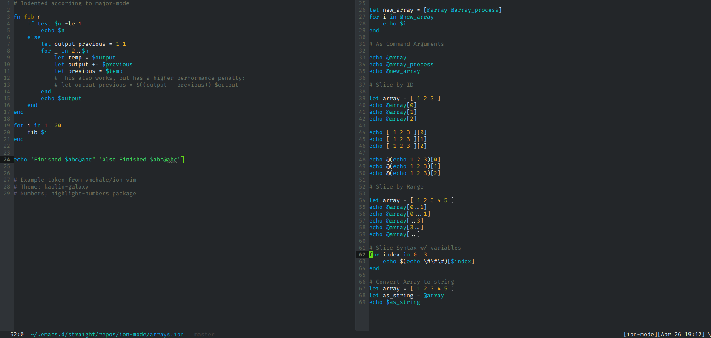

# ion-mode
Emacs major mode for scripting with the [ion-shell](https://gitlab.redox-os.org/redox-os/ion). 


## Installation
You can download this package from github and put it in your load path, then use
`(require ion-mode)`. If you want to automatically active `ion-mode`, you would
need to modify `auto-mode-alist` to your `init.el`.  A full manual installation
might look like:

``` emacs-lisp
(add-to-list 'load-path  (expand-file-name "/path/to/ion-mode"))
(require 'ion-mode)
(autoload 'ion-mode (locate-library "ion-mode") "Ion majore mode" t)
(add-to-list 'auto-mode-alist '("\\.ion\\'" . ion-mode))
(add-to-list 'auto-mode-alist '("/ion/initrc" . ion-mode))
```

Alternatively, you can use `straight` and/or `use-package`. I use

``` emacs-lisp
;; Assuming that use-package and straight are already setup
(use-package ion-mode
  :straight (ion-mode
	       :host github :repo "iwahbe/ion-mode")
  :mode ("\\.ion\\'" . ion-mode)
  )
```

This package has no dependencies. 

## Functionality
Currently `ion-mode` provides syntax highlighting using `font-lock` and mode
specific indentation. Details can be found in `ion-mode.el`, but nothing should
require customization. If you use company, then `ion-mode` provides a backend
called `company-ion`. This can be added in the normal way:

``` emacs-lisp
(add-to-list 'company-backends company-ion)
```

Example:



