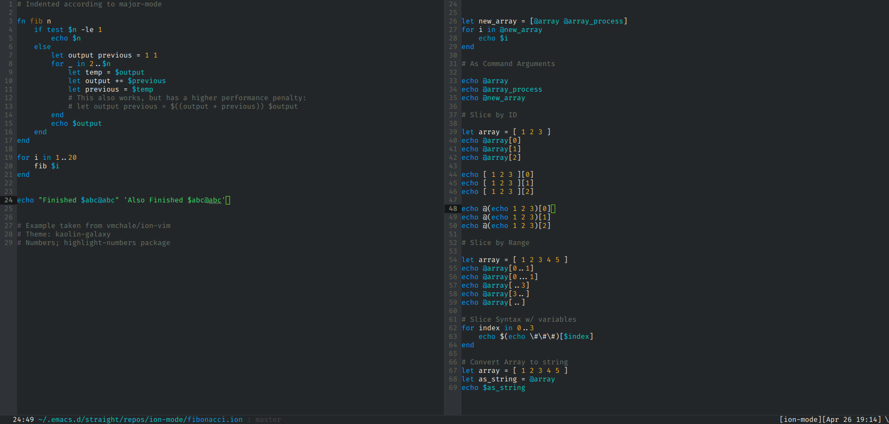

# ion-mode
Emacs major mode for scripting with the [ion-shell](https://gitlab.redox-os.org/redox-os/ion). 


## Installation
You can download this package from github and put it in your load path, then use
`(require 'ion-mode)`. If you want to automatically active `ion-mode`, you would
need to add `(add-to-list 'auto-mode-alist '("\\.ion\\'" . ion-mode))` to your
`init.el`. 

Alternatively, you can use `straight` and/or `use-package`. I use

``` emacs-lisp
(use-package ion-mode
  :straight (ion-mode
	       :host github :repo "iwahbe/ion-mode")
  :mode ("\\.ion\\'" . ion-mode)
  )
```

This package has no dependencies. 

## Functionality
Currently `ion-mode` provides syntax highlighting using `font-lock` and mode
specific indentation. Details can be found in `ion-mode.el`, but nothing should
require customization.

Example:



